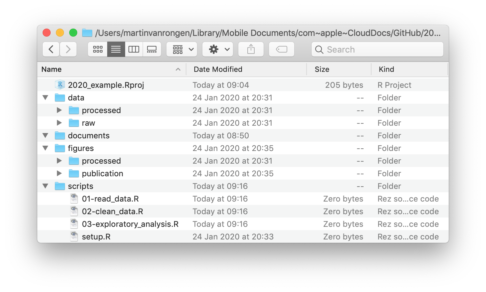
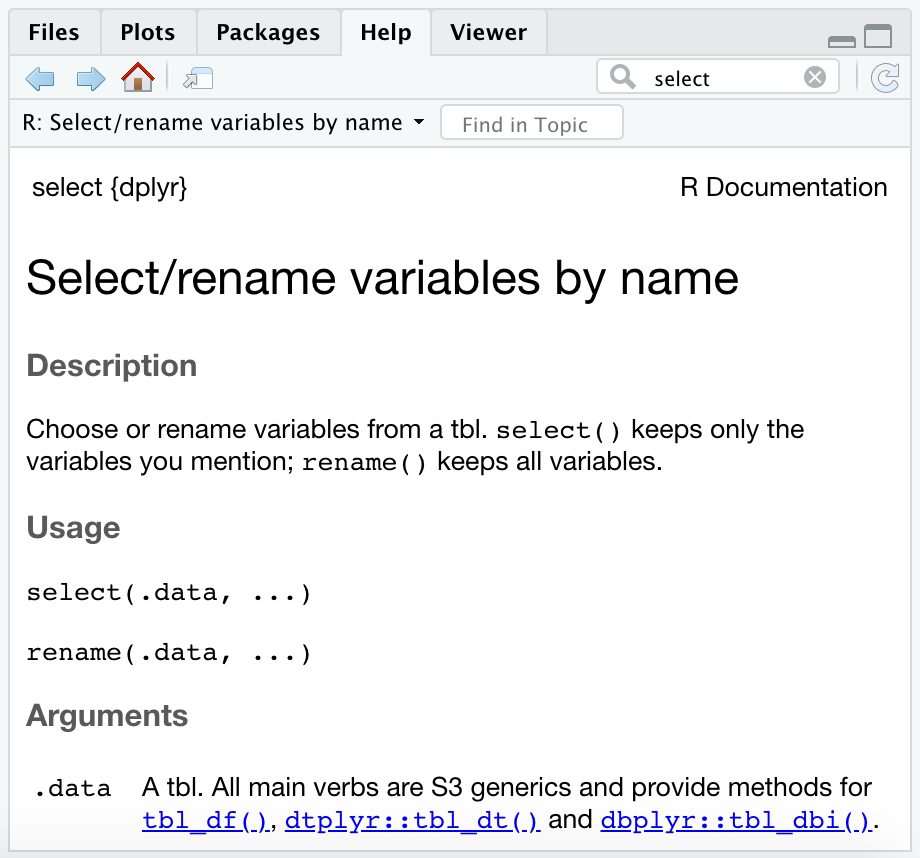

```{r, echo=FALSE, purl=FALSE, message = FALSE}
source("setup.R")
```

<br/>

# Getting started {#gettingstarted}

## R

```{r, results='markup', echo=FALSE, purl=FALSE, out.width='10%', fig.align='left'}
knitr::include_graphics("img/Rlogo.png")
```

R is a statistical programming language widely used in the data science field.

**R provides a record of your analysis**

R uses scripts to record which steps you take during your analysis. Although this might initially take longer to learn than pointing and clicking your way through some other software, it makes it much easier to go back to your analysis in the future and re-do or adjust it, if needed. An added benefit is that it enables you to make comments as to _why_ you've done certain steps in your analysis.

**Reproducibility**

It's the latest buzz-word in science and for good reason! Using R to record every step of your analysis and linking this to the original raw data that you used to do the analysis allows people to reproduce your work. This may very well be your future self!

This kind of record also enables other people to decide for themselves if the choices you've made in the analysis are reasonable and allows them (and yourself) to spot any mistakes.

For those of you who work in academia there is an added advantage. An increasing number of journals and funding bodies now require you to deposit your raw data and the analysis that led to your conclusions. Knowing how to use R can really be a benefit here.

Even news agencies, such as the [BBC Shared Data Unit](https://github.com/BBC-Data-Unit) now make the underlying analysis of many of their news items available, many of which are performed in R. With the onset of "fake news", more and more people are expecting transparency!

## RStudio

When opening RStudio you're greeted with the following screen (note that this may look different on your computer, depending on your operating system and colour scheme):

```{r, results='markup', echo=FALSE, purl=FALSE, out.width='100%', fig.align='center'}
knitr::include_graphics("img/rstudio_on_start.png")
```

There are three panels visible at this stage, clock-wise:

1. **Console**. The console can be used to execute code in directly.
2. **Environment**. This displays all the data that is loaded into R's memory.
3. **Files/Plots/Packages/Help/Viewer**. These tabs show the Files in your directory, any Plots you have created, Packages that are installed, a Help function and a Viewer pane that can be used for local web content.

A bit more about the console. Although it can be useful to execute code directly (in the case of one-off actions, such as the installation of packages) you will want to save your code most of the time so you can share it or refer back to it later. In that case it's good to start a **script** to write the code in.

To start a new script go to `File -> New File -> R Script`.
Your new screen will look something like this, with a new panel appearing in the top right corner:

```{r, results='markup', echo=FALSE, purl=FALSE, out.width='100%', fig.align='center'}
knitr::include_graphics("img/rstudio_all_panels.png")
```

## Data organisation

### Working directory

You might have noticed that the bottom right panel contains five different tabs, one of which is called `Files`. In our example it shows the current **working directory**. The concept of a working directory is very important one. When we're working on a project, it is good practice to keep all the data, scripts, images and any other files contained in a single folder. This single folder we call the working directory and it allows us to use **relative paths** in scripts as opposed to **absolute paths**.

> **Relative path**: data/raw/gapminder.csv
>
> **Absolute path**: C:/Users/Admin/Documents/R/Projects/2020_example/**data/raw/gapminder.csv**

The beauty of using relative paths is that you can move the working directory folder to any location you like and all the references and links in the scripts will continue to work. Hard coding absolute paths is always a bad idea because it makes it much harder to share your code because it is all linked to a specific directory on _your_ computer.

### Directory structure

Apart from using a working directory it also pays off to think about how to organise your files within it. In this example the working directory is called `2020_example` and it contains several other directories to organise our files:

```{r, results='markup', echo=FALSE, purl=FALSE, out.width='100%', fig.align='center'}

```

- the **`data`** folder contains a `raw` and `processed` sub-folder. This is often a good idea, because you want to make sure you never overwrite your original, raw data. Any analyses can always be repeated (save your script!) and the output of them can go into the `processed` data folder.
- the **`documents`** folder contains documents that are relevant to the project.
- the **`figures`** folder can contain sub-folders to separate quick exploratory plots and publication-quaility figures.
- a **`scripts`** folder contains all the scripts used in the analyses. It often helps to order them and name them consistently, such as `01-read_data.R`, `02-clean_data.R`, `03-exploratory_analysis.R` etc. It'll save you a lot of headache when trying to find things back in the future!

The working directory also contains a file named `2020_example.Rproj`. This is a file that is created by RStudio and when you open that it automatically opens RStudio in a new session and sets the working directory to where this `Rproj` file is located. Useful! To create your own R project, go to `File -> New Project`.

> **Note**: You can **create new directories** by clicking on the `New Folder` button or by creating them directly in your file browser.
>
> It is good practice to **avoid any spaces** in your directory names because these names can create issues when used in code. Instead, you can use the underscore.
>
> R is also case-sensitive, so **be consistent in your use of uppercase and lowercase**. I personally use lowercase exclusively because it's one less thing to think about!

## Data availability

## Getting help

R has a built-in Help function. There is a tab in the lower-right pane with a search bar. You would use this, for example, if you want to find out more about a specific function (more on them later).

Below shows an example where we're looking at the help page of the `select` function:

```{r, results='markup', echo=FALSE, purl=FALSE, out.width='50%', fig.align='center'}

```

Although the information might not always make sense, especially when you're just starting to use R, it can help point you in the right direction. The first line here states `select{dplyr}`, which means we are looking at the help for the `select` function from the `dplyr` package.

There is usually a description, usage and arguments section which help you decide what to input into the function. Most help pages have a working example at the bottom of the page and this can be extremely useful to decode how something works!

Another way of accessing the help is typing it into the console. Let's say we want to know more about the `round()` function, then we can type:

```{r eval=FALSE}
?round
```

Finally, one of the most effective ways to find help is to use a Google search. For example, search for "how to use round function in R" will give you lots of relevant information. The same strategy works really well if you get an error message. Just copy it into a Google search and usually something useful comes up!


